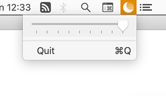

# Darker

Darker allows you to dim your screen beyond the last screen brightness beam.

## Install

You will need macOS 10.10 or newer.
   Download and unzip the tar.gz from [latest release](https://github.com/relikd/Darker/releases/latest).

Alternatively, you can compile Darker from source by running `make`.

Or call the script directly (`swift src/main.swift`) without building an app bundle.

**Note:** If you are using macOS 10.14.3 or lower, you will need the Swift 5 Runtime Support.
You can download either from [Apple](https://developer.apple.com/download/all/) (developer account required) or use the [dmg](Swift_5_Runtime_Support_for_Command_Line_Tools.dmg) provided with this project.

## FAQ

### Why?

There are a number of other tools in the AppStore that do exactly the same.
So why bother in creating a new solution?
Well, previously I used QuickShade and was happy with it.
But I moved away from the AppStore and this was my last application that was only available via AppStore.
I asked the developer if the source code is available but got no reply.
So, thats why you have this open source project now ;-)

The app is just a wrapper around a single code line (`CGSetDisplayTransferByTable`) and was finished in just half a day.
Enjoy.

### Develop

You can either run the `main.swift` file directly with `swift main.swift`, via Terminal `./main.swift` (`chmod 755 main.swift`), or create a new Xcode project.
In Xcode, select the Command-Line template and replace the template provided `main.swift` with this one.
