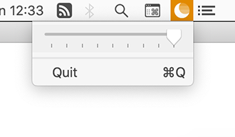

[](#)
[](https://github.com/relikd/Darker/releases/latest)
[](https://github.com/relikd/Darker/releases)


Darker
======

Dim your screen beyond the last screen brightness beam.




The app is just a wrapper around a single code line (`CGSetDisplayTransferByTable`).


Installation
------------

Requires macOS Yosemite (10.10) or higher.

```sh
brew install --cask relikd/tap/darker
xattr -d com.apple.quarantine /Applications/Darker.app
```

or download from [releases](https://github.com/relikd/Darker/releases/latest).

### macOS 10.14.3 or lower

You'll need the Swift 5 Runtime Support.
Download either from [Apple](https://developer.apple.com/download/all/) (developer account required)
or use [this dmg](https://github.com/relikd/Darker/raw/refs/heads/main/Swift_5_Runtime_Support.dmg).


### Build from source

- Run `make` to create an app bundle.
- OR: call the script directly (`swift src/main.swift`).
- OR: create a new Xcode project, select the Command-Line template, and replace the provided `main.swift` with this one.


FAQ
---

### Why?

There are a number of other tools in the AppStore that do exactly the same.
So why bother in creating a new solution?
Well, previously I used QuickShade and was happy with it.
But I moved away from the AppStore and this was my last application that was only available via AppStore.
I asked the developer if the source code is available but got no reply.
So, thats why you have this open source project now ;-)

Enjoy.
